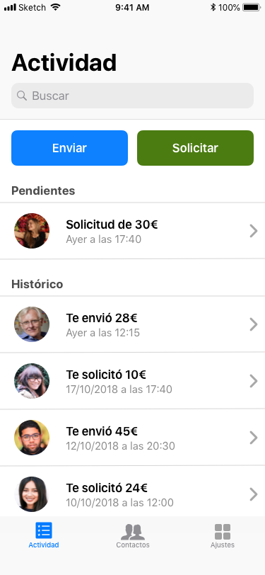

# PayOrDie (Práctica Bootcamp Mobile)

PayOrDie es una aplicación sencilla que sirve para pagar a un amigo al que le debemos dinero o pedir a un amigo que nos mande dinero.

**Explica las decisiones más importantes que has tomado y que consideres más importantes.**

Al principio pensaba hacer una pantalla principal con las tareas y el histórico en forma de tarjetas, pero luego me decidí por algo más sobrio y familiar para el usuario. Por otro lado, también tenía dudas de cara a situar los botones principales (enviar y solicitar dinero), y aunque mi primera idea fue incluirlos en la navigation bar, pensé que era mejor mostrarlos de forma destacada justo debajo.

En cuanto al flujo para pedir o enviar dinero, he divido el proceso en dos pantallas. Tenía pensado hacerlo en una única ventana modal, pero consideré que dividir la tarea primero en seleccionar el destinatario y luego la cantidad con el motivo sería más claro de cara a la usabilidad.

**Desde el punto de vista humano, ¿qué cuestiones crees que son clave?**

Por un lado, he pensado que la aplicación sea sencilla de usar y que no haya que aprender nuevas metáforas visuales. Por otro lado, he evitado colores de fondo oscuros, y he empleado colores claros como el azul para los botones para dar cierta sensación de seguridad. El único tono rojo lo he usado para la acción de cancelar.

**¿Qué onboarding crees que sería el adecuado?**

Habría que guiar al usuario en la importación de usuarios y para que añada al menos una fuente de fondos, ya que sin estos elementos la app sería inútil. Luego, en la pantalla inicial de actividad habría que animar a realizar la primera solicitud o envío de dinero, al menos hasta que haya alguna acción en el histórico.